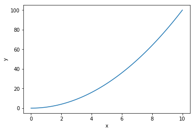

---
redirect_from:
  - "/part-1/introduksjon"
interact_link: content/part_1/introduksjon.ipynb
title: 'Introduksjon'
prev_page:
  url: /part_1/index
  title: 'Part 1'
next_page:
  url: /part_2/index
  title: 'Part 2'
comment: "***PROGRAMMATICALLY GENERATED, DO NOT EDIT. SEE ORIGINAL FILES IN /content***"
---

# Introduksjon

I dette kurset skal vi lære hvorfor det er viktig å programmere, og så skal vi lære å programmere og å lære bort å programmere.

## Hva er programmering?


## Eksempler

### Andregradsfunksjonen


{:.input_area}
```python
from pylab import *
def f(x):
    return x**2

x = linspace(0, 10, 100)
y = f(x)

plot(x, y)
xlabel("x")
ylabel("y")
show()
```


{:.output .output_png}



